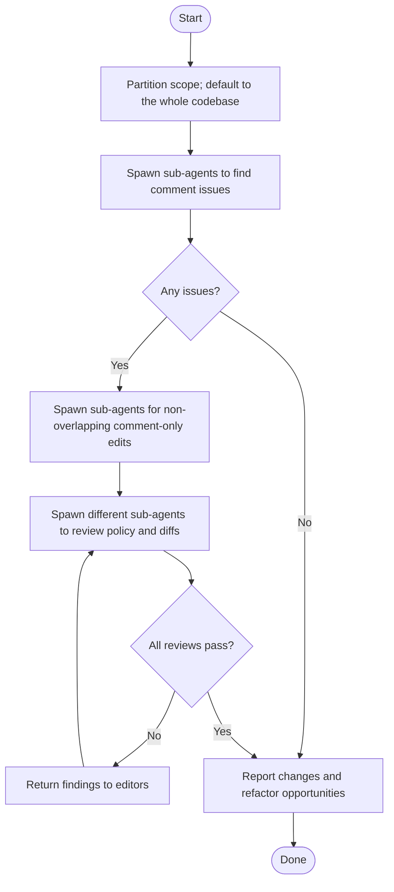

# Enhance Comments loop

[RecallOS comment guidelines](../../../docs/engineering/comments.md) are the
source of truth. Every sub-agent must read them.

## Authorization and agent roles

- Explicit invocation of this skill authorizes its documented sub-agent workflow.
- Do not run it merely because a request matches the subject matter.
- The main agent scopes work, delegates edits, coordinates independent review,
  verifies the result, and reports. It does not perform delegated edits itself.
- If sub-agents cannot be spawned, report the workflow as blocked instead of
  silently completing it as a single agent.

## Overview



## Guardrails

- Explorers do not edit; they report each candidate's location, action, and
  rationale.
- Editors change only comments and blank lines. Preserve `GIVEN`, `WHEN`, and
  `THEN`; report required code refactors instead of making them.
- Reviewers must be independent from editors. Repeat editing and review until
  every scope passes.

## Verify

Each reviewer must confirm its diff changes only comments and blank lines:

```bash
git diff -U0 -- <edited-paths> | grep -E '^[+-]' | grep -vE '^(\+\+\+|---)' \
  | grep -vE '^[+-][[:space:]]*(//|/\*\*?|\*|\*/|$)'
```

The command must print nothing. Return failures to an editor.
