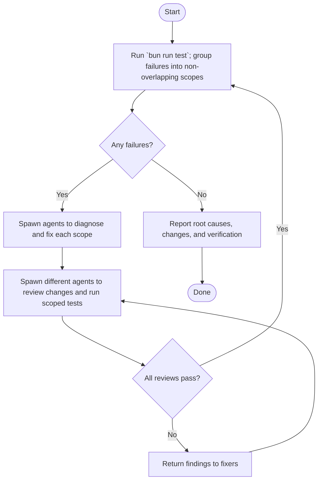

# Fix Unit Tests loop

[RecallOS server unit testing pattern](../../../docs/engineering/server-unit-testing.md)
is the source of truth. Every sub-agent must read it. The main agent only orchestrates.

## Overview

## Guardrails

- Give each fixer a non-overlapping failure scope; fixers diagnose root cause and
  make only the minimal related changes.
- Do not skip tests, weaken assertions, or change unrelated production code.
- Reviewers must be independent from fixers. Repeat fixing and review until every
  scope passes.

## Verify

- Fixers run the smallest command that reproduces their assigned failures.
- Reviewers inspect the scoped diff and run the affected workspace's test task.
- The main agent runs `bun run test` after all reviews pass; repeat the loop until
  the full suite passes.
