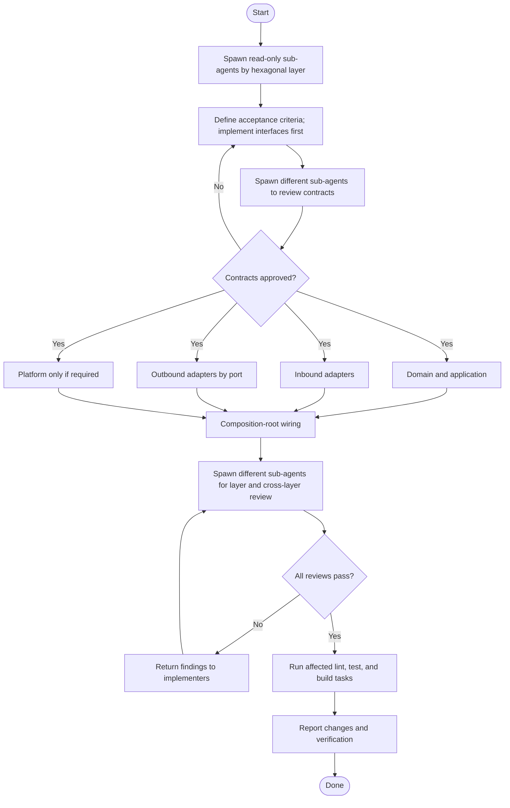

# Server Feature loop

[RecallOS engineering patterns](../../../docs/engineering-patterns/README.md) are the source
of truth. Every sub-agent must read the patterns for its scope.

## Authorization and agent roles

- Explicit invocation of this skill authorizes its documented sub-agent workflow.
- Do not run it merely because a request matches the subject matter.
- The main agent scopes work, defines acceptance criteria, delegates implementation,
  coordinates independent review, runs final checks, and reports. It does not
  perform delegated implementation itself.
- If sub-agents cannot be spawned, report the workflow as blocked instead of
  silently completing it as a single agent.

## Overview

## Guardrails

- Explorers do not edit. Partition implementation by required hexagonal layers and
  give concurrent sub-agents non-overlapping files.
- Approve domain types, DTOs, and ports before dependent implementations. Sequence
  domain before application when needed; run independent adapters in parallel.
- Keep dependencies pointing inward and put behavior, translation, infrastructure,
  and wiring in their prescribed layers.
- Implement only requirements. Do not add just-in-case abstractions, configuration,
  extension points, fallbacks, compatibility layers, or imagined error handling.
- Reviewers must be independent from implementers. Preserve unrelated user changes
  and repeat implementation and review until every scope passes.

## Verify

- Implementers run the smallest relevant checks for their scope.
- Reviewers inspect scoped diffs and run affected workspace checks.
- The main agent runs affected lint, test, and build tasks; use repository-wide
  checks when the feature crosses workspaces.
